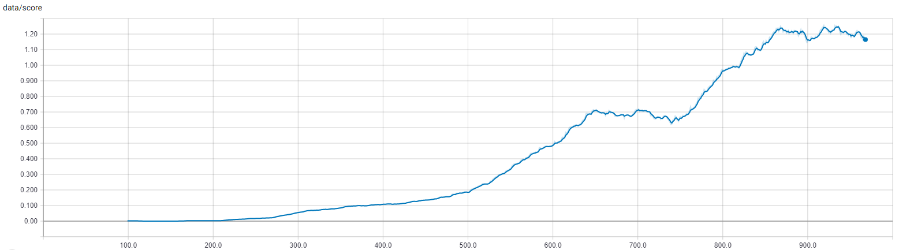

# Report 

## Summary 
The [DDPG (Deep Deterministic Policy Gradient)](https://arxiv.org/abs/1509.02971) algorithm is used to train both agents at the same time.

The figure below illustrates the average score over the last 100 episodes obtained during training.

It is observed that, with the proposed network architecture and hyperparameters, the learning is stable. The environment is solved in 603 episodes and the final score converges to a maximum of 1.26.

## Network Architecture 

Both agent states and actions are combined for training. Actor and critic networks with continuous action space are used. The tables below summarize the architecture used.

### Critic 

| Type | Input | Output |
------------ | ------------- | -------------
Fully Connected | State (2x24) | 256
Fully Connected | 256 + Action (2x2) | 128
Fully Connected | 128 | 1 

### Actor

| Type | Input | Output |
------------ | ------------- | -------------
Fully Connected | States (2x24) | 256
Fully Connected | 256 | 128
Fully Connected | 128 | Action (2x2) 

## Hyperparameters

The hyperparameters used during training are:

Parameter | Value | Description
------------ | ------------- | -------------
Episodes | 1500 | Number of training episode
Steps | 2000 | Maximum number of steps per episode
Learning rate, critic | 1e-3 | Learning rate of the critic network
Learning rate, actor | 1e-4 | Learning rate of the actor network
Tau | 0.01 | Target network soft update rate
Gamma | 0.99 | Discount rate 
Batch size | 256 | Size of each training batch sampled from the replay buffer
Buffer size | 100 | Size of the replay buffer
Exploration mu | 0.0 | Ornstein-Uhlenbeck mu
Exploration theta | 0.15 | Ornstein-Uhlenbeck theta
Exploration sigma | 0.20 | Ornstein-Uhlenbeck sigma
Noise decay rate |  0.99995 | Decay rate used to scale the noise level per episode

## Further work 

- Use a multi-agent training algorithm such as [MMADPG](https://arxiv.org/abs/1706.02275).
- Modify the DDPG to use a prioritied experience replay to accelerate and stabilize training.
- Modify the exploration behavior of the agent to favorise exploration. For example, use [parameter noise](https://blog.openai.com/better-exploration-with-parameter-noise/).

